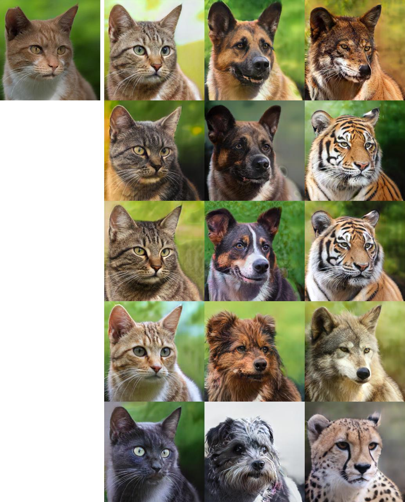
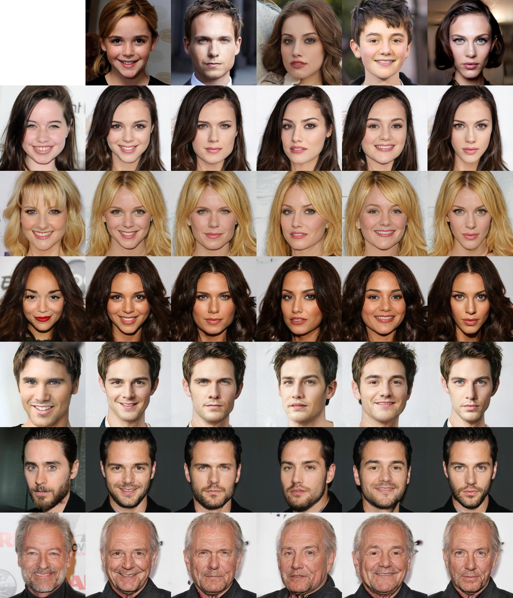

简体中文 | [English](README_en.md)

# Starganv2

---
## 内容

- [环境依赖](#环境依赖)
- [数据准备](#数据准备)
- [模型训练](#模型训练)
- [模型测试](#模型测试)
- [参考论文](#参考论文)
- [其它参考](#其它参考)


## 环境依赖
* `paddlepaddle-gpu`
* `opencv-python`
* `Pillow`
* `tqdm`

## 数据准备

模型的训练数据采用celeba_hq和afhq数据集。

*  方法1：
原始数据请在[celeba_hq数据集](https://www.dropbox.com/s/f7pvjij2xlpff59/celeba_hq.zip?dl=0ZIP_FILE=./data/celeba_hq.zip)下载
原始数据请在[afhq数据集](https://www.dropbox.com/s/t9l9o3vsx2jai3z/afhq.zip?dl=0ZIP_FILE=./data/afhq.zip)下载

数据存放位置：

```
├── dataset
   └── YOUR_DATASET_NAME
       ├── train
           ├── domain1 (domain folder)
               ├── xxx.jpg (domain1 image)
               ├── yyy.png
               ├── ...
           ├── domain2
               ├── aaa.jpg (domain2 image)
               ├── bbb.png
               ├── ...
           ├── ...
           
       ├── test
           ├── ref_imgs (domain folder)
               ├── domain1 (domain folder)
                   ├── ttt.jpg (domain1 image)
                   ├── aaa.png
                   ├── ...
               ├── domain2
                   ├── kkk.jpg (domain2 image)
                   ├── iii.png
                   ├── ...
               ├── ...
               
           ├── src_imgs
               ├── src1.jpg 
               ├── src2.png
               ├── ...
```


*  方法2(建议采用该方法)：

直接在aistudio下载数据集[图片数据集](https://aistudio.baidu.com/aistudio/datasetdetail/42681)并放在指定文件夹：


## 模型训练

数据准备完成后，可通过如下方式启动训练：

```
python main.py --dataset YOUR_DATASET_NAME --phase train
```
加载[预训练模型](https://aistudio.baidu.com/aistudio/datasetdetail/42681),放入checkpoint下对应的文件夹：


例如：
```
将afhq-model中的模型参数放在./checkpoint/StarGAN_v2_afhq_gan下
python main.py --dataset afhq --phase train --gan_type gan --choice finetune
```
```
python main.py --dataset YOUR_DATASET_NAME --phase train --choice finetune
```

## 模型测试

可通过如下命令进行模型测试，生成图片:

```
python main.py --dataset YOUR_DATASET_NAME --phase test
```

批量生成图片，结果保存在./result/下
将生成图片放入原官方项目的/expr/results/YOUR_DATASET_NAME/下
执行eval得出json结果
```
python main.py --dataset YOUR_DATASET_NAME --phase val
```

- 通过 `--choice`参数指定待测试模型文件的路径，您可以下载我们训练好的[模型进行测试](https://aistudio.baidu.com/aistudio/datasetdetail/42681) 
评估精度如下:
```
{
    "FID_latent/dog2cat": 6.348090980447171,
    "FID_latent/wild2cat": 7.153145615262241,
    "FID_latent/cat2dog": 35.8779838693946,
    "FID_latent/wild2dog": 29.871621589004825,
    "FID_latent/cat2wild": 9.040702566584482,
    "FID_latent/dog2wild": 8.575354851017934,
    "FID_latent/mean": 16.14448324528521
}
```
| AFHQ_FID_latent | 
| :---: | 
| 16.14448324528521 | 


```
{
    "FID_latent/male2female": 9.940602816654017,
    "FID_latent/female2male": 17.474585409625757,
    "FID_latent/mean": 13.707594113139887
}
```
| CELEBA_HQ_FID_latent | 
| :---: | 
| 13.707594113139887 | 


## 参考论文

- [StarGAN v2: Diverse Image Synthesis for Multiple Domains](https://arxiv.org/abs/1912.01865), Yunjey Choi, Youngjung Uh, Jaejun Yoo, Jung-Woo Ha

## 其它参考

- [AI Studio 项目链接](https://aistudio.baidu.com/aistudio/projectdetail/638962)

### Latent-guided synthesis
#### CelebA-HQ


#### AFHQ


### Reference-guided synthesis
#### CelebA-HQ


#### AFHQ


